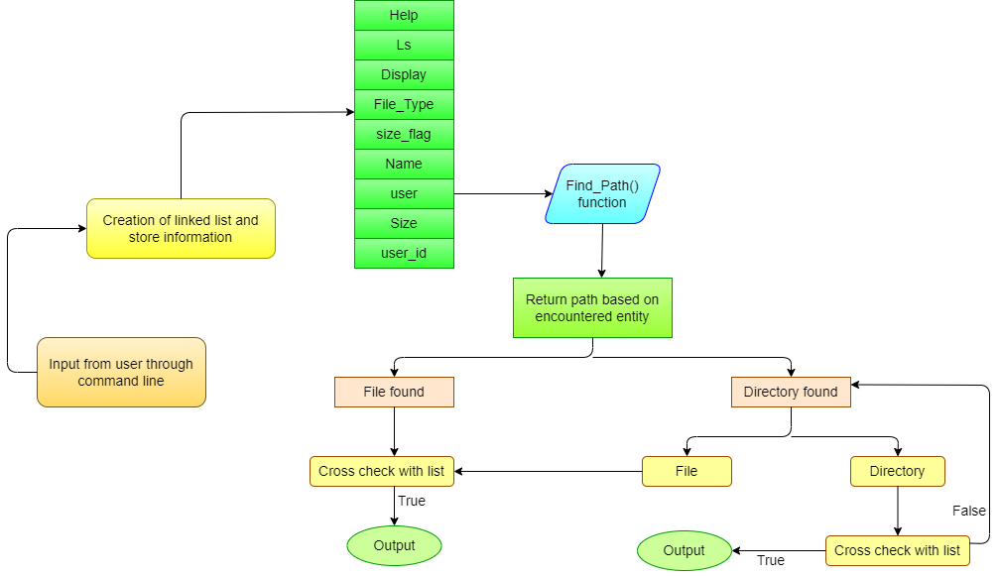

### Find Command Implementation in C
* The find command is used to locate files on Linux or Unix system. Find will search any set of directories you specify for files that match the supplied search criteria.
* Find command can traverse and search through different file systems of partitions of directory.
* Find command has various functionalities like search by name, file type, user, size etc.
* Syntax : find [paths] [options] [expression]  
* <b>DATA STRUCTURE USED</b> : Linked List

<hr>

### Functionalities implemented
1. <b>find <directory> –name <file/directory name> </b>:
Return paths to all files or directories in given directory whose name matches with the given filename.
2. <b> find <directory> -user <name/user id></b>:
Return path to files associated with the given user.
3. <b>find <directory> -type <b/c/d/p/f/s/l> </b>:
Return paths to all files which matches with the given file type.
```
b - Block files
c - Character files
d - Directory files
p - Pipe files
f - Regular files
s - Socket files
l - Symbolic link files
```
4. <b>find <directory> -display </b>:
Return path to each file or directory present in given directory.
5. <b>find <directory> -size <l/e/g> <size (in bytes)> </b> : 
Return paths to files having size greater than/equal to/less than given size.
```
l - less than
e - equal
g - greater than
```
6. <b>find <directory> -ls </b>:
Return information about each entry of directory, for eg. file serial number, file type, size in bytes, modification date and time , path ,etc.
7. <b>find <directory> -help </b>:
Print information about how to use find command implemented.

<hr>

### Project Flow


### References
1. <b>Linux Manual Page</b>: https://man7.org/linux/man-pages/man1/find.1.html
2. <b>Wikipedia</b>: https://www.gnu.org/software/findutils/manual/html_mono/find.html
https://en.wikipedia.org/wiki/Find_(Unix)
3. <b>Google</b>: https://stackoverflow.com/questions/7057520/find-command-in-c